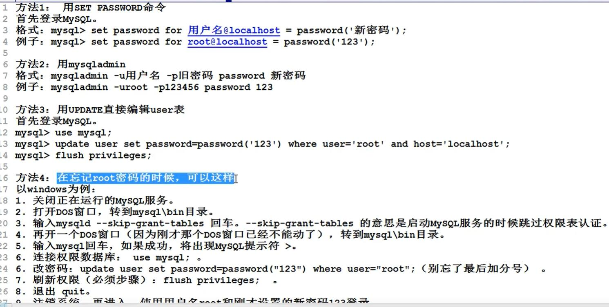
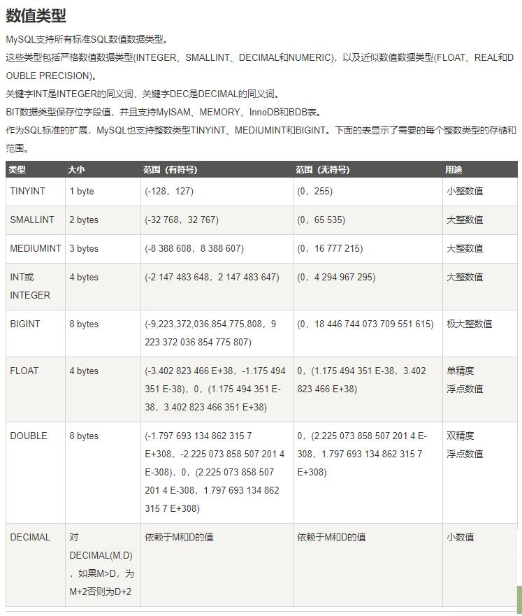
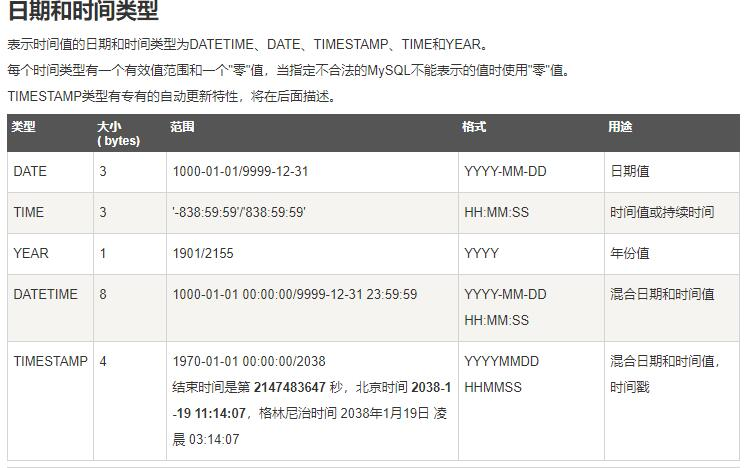
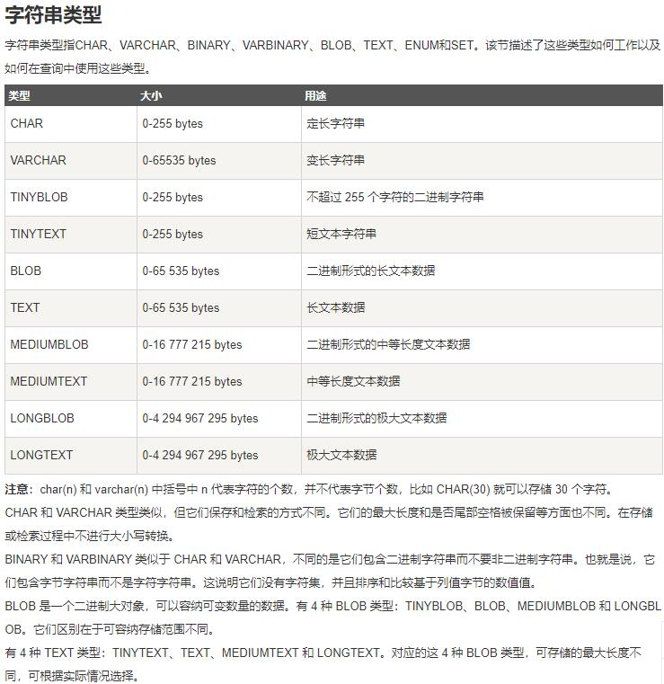
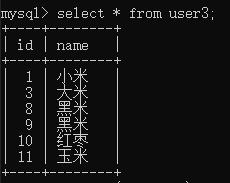
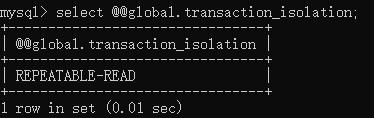
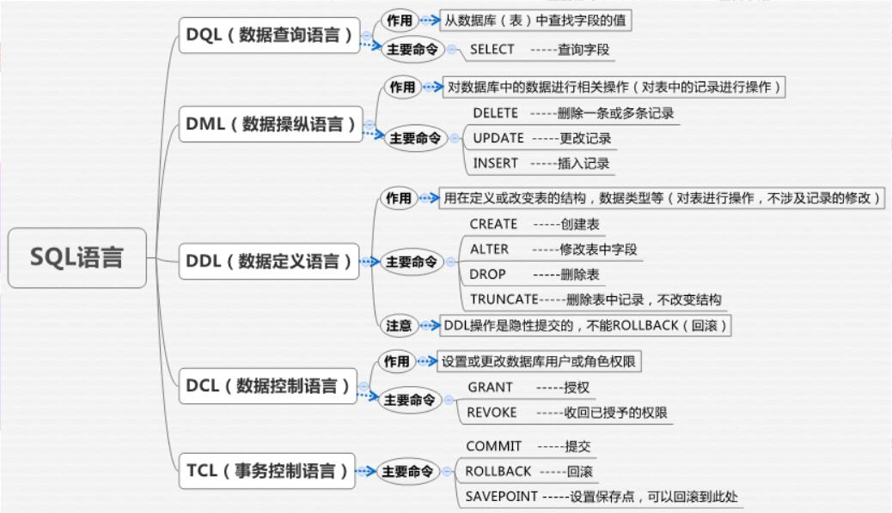

# MySql学习笔记

## 1. MySql [参考手册](http://dev.mysql.com/)

## 2. 数据库常用操作（增删改查）



### 2.1 增

> 在数据库服务器中，创建数据库

* ```CREATE DATABASE database_name;```

> 在数据库服务器中，创建数据表

```Sql
USE student;
CREATE TABLE table_name(
    name VARCHAR(20),
    sex CHAR(1),
    birth DATE);
```

> 往数据表中添加数据记录

```Sql
INSERT INTO table_name
VALUES ('张三','男','2010-02-21');
INSERT INTO table_name
VALUES ('李四','男','2009-01-21');
```

### 2.2 删

> 删除数据

```DELETE FROM table_name WHERE NAME='牛坤';```

> 删除数据表

```DROP TABLE table_name;```

> 删除数据库

```DROP DATABASE database_name;```

### 2.3 改

> 修改数据

```UPDATE table_name SET name='王五' WHERE name='张三'```

> 修改表名

```ALTER TABLE old_table_name RENAME TO new_table_name```

> 修改数据库名字

* <https://blog.csdn.net/gruhgd/article/details/84065218>

> 修改列的数据类型

```ALTER TABLE table_name MODIFY COLUMN column_name new_type;```

> 修改列的名字

```ALTER TABLE old_table_name CHANGE COLUMN old_column_name new_column_name new_column_type```

### 2.4 查

> 查询所有数据库

* ```SHOW DATABASES;```

> 使用具体数据库，并查看该数据库所有表格

* ```USE database_name;```
* ```SHOW TABLES```

> 查看创建好的数据表的结构

```USE table_name;```
```DESCRIBE table_name;```

> 查询具体表

* ```SELECT * FROM table_name;```
* ```SELECT column_name FROM table_name;```
* ```SELECT column_name FROM table_name WHERE column_name=1;```

> MySql版本查询

* ```SELECT VERSION();```
* ```STATUS; 或者 /s;```

* 查看mysql默认字符集
* ```SHOW VARIABLES LIKE "character%";```

### 2.4 退

> 退出数据库

* ```QUIT;```
* ```EXIT;```

### 2.5 常用数据类型

> MySql常用数据类型

* 支持多种数据类型，大致分为三类：
* 数值类型
* 
* 日期/时间类型
* 
* 字符串（字符）类型
* 

> [MySql的默认字符集设置](https://blog.csdn.net/gh_love/article/details/98097234)

## 3. MySql建表约束

> 主键约束（可设置多个字段为主键）（**不可重复！不可为空！**）。
>> 联合主键,即如果有多个主键，只要其中一个不同即可。  
>> 能够唯一确定一张表中的记录，也就是我们通过某个字段添加约束，就可以使得字段不重复且不为空。  
>> 如果建表的时候，忘记指定主键？

```Sql
CREATE TABLE user(
    id int PRIMARY KEY,
    name varchar(20)
);

CREATE TABLE user2(
    id int,
    name varchar(20),
    password varchar(20),
    PRIMARY KEY(id,name)
);

CREATE TABLE user4(
    id int,
    name varchar(20)
);
/* 添加主键 */
ALTER TABLE user4 add PRIMARY KEY(id,name);
/* 删除主键 */
ALTER TABLE user4 DROP PRIMARY KEY;
/* 修改主键 */
ALTER TABLE user4 MODIFY id int PRIMARY KEY;
```

>> 删除含有外键约束的主键

<https://blog.csdn.net/CSDN_Mr_H/article/details/90317043>

> 自增约束

```Sql
CREATE table user3(
    id int PRIMARY AUTO_INCREMENT,
    name varchar(20)
);

INSERT INTO user3 VALUES(NULL,'小米');
INSERT INTO user3 VALUES(3,'大米');
INSERT INTO user3 VALUES(8,'大米');
INSERT INTO user3 VALUES(NULL,'大米');
INSERT INTO user3 (name)VALUES('红枣');
INSERT INTO user3 (name)VALUES('玉米');
```



> 唯一约束
>> 约束修饰的字段的值不可以重复。

```Sql
create table user5(
    id int,
    name varchar(20)
);

/* 添加唯一约束 三种方法*/
ALTER TABLE user5 ADD UNIQUE(name);

ALTER TABLE user5 MODIFY name varchar(20) unique;


CREATE TABLE user6(
    id int,
    name varchar(20),
    unique(id)
);

/* 删除唯一约束 */
ALTER TABLE user6 drop INDEX id;
```

> 非空约束
>> 修饰的字段不能为空。

```Sql
CREATE TABLE user7(
    id int,
    name varchar(20) NOT NULL
);
```

> 默认约束
>> 当插入字段值的时候，如果没有传值使用默认值。

```Sql
CREATE TABLE user8(
    id int,
    bane varchar(20),
    age int DEFAULT 18
);

```

> 外键约束
>> 涉及到两个表：父表，子表。  
>> 主表，副表。  
>> 主表中没有的数据，副表不可以使用。  
>> 主表中的记录被副表引用，是不可以删除的。

```Sql
/* 班级表 */
CREATE TABLE classes(
    id int PRIMARY KEY,
    name VARCHAR(20)
);

/* 学生表 */
CREATE TABLE students(
    id int PRIMARY KEY,
    name VARCHAR(20),
    class_id int,
    foreign key(class_id) references classes(id)
);

/* 往班级表插入数据 */
INSERT INTO classes values(1,'一班');
INSERT INTO classes values(2,'二班');
INSERT INTO classes values(3,'三班');
INSERT INTO classes values(4,'四班');

/* 往学生表插入数据 */
INSERT INTO students VALUES(2018,'张三',1);
INSERT INTO students VALUES(2019,'张三',2);
INSERT INTO students VALUES(2020,'张三',3);
INSERT INTO students VALUES(2021,'张三',4);

/* 主表中没有的数据，副表不可以使用 */
INSERT INTO students VALUES(2022,'张三',5);

/* 主表中的记录被副表引用，是不可以删除的。 */
DELETE FROM classes WHERE id=1;

```

## 4. 数据库的三大设计范式

### 4.1 第一范式

> 数据表中所有字段都是不可分割的原子值。
> 范式，设计的越详细，对于某些操作越好，但是不一定都是好处。

```Sql

/* 字段直还可以继续拆分，不满足第一范式 */
CREATE TABLE student2(
    id INT PRIMARY KEY,
    name VARCHAR(20),
    address VARCHAR(30)
);
INSERT INTO student2 VALUES(1,'张三','中国四川省成都市成电');
INSERT INTO student2 VALUES(2,'张四','中国四川省成都市成电');
INSERT INTO student2 VALUES(3,'张五','中国四川省成都市成电');

/* 满足第一范式例子 */
CREATE TABLE student3(
    id INT PRIMARY KEY,
    name VARCHAR(20),
    country VARCHAR(30),
    province VARCHAR(30),
    city VARCHAR(30),
    details VARCHAR(30)
);
INSERT INTO student3 VALUES(1,'张三','中国','四川省','成都市','成电');
INSERT INTO student3 VALUES(2,'李四','中国','四川省','成都市','成电');
INSERT INTO student3 VALUES(3,'王五','中国','四川省','成都市','成电');
```

### 4.2 第二范式

> 必须满足第一范式的前提下，第二范式要求，除主键外的每一列必须完全依赖于主键。  
> 如果不依赖于，只可能发生在联合主键的情况下。

```Sql

/* 不满足第二范式 */
CREATE TABLE myOrder(
    product_id int,
    customer_id int,
    product_name varchar(20),
    customer_name varchar(20),
    primary key(product, customer_id)
);

/* 满足第二范式 拆分成三个表*/
CREATE TABLE myOrder(
    order_id int primary key,
    product_name int,
    customer_id int
);

CREATE TABLE product(
    id int primary key,
    name varchar(20)
);

CREATE TABLE customer(
    id int primary key,
    name varchar(20)
);


```

### 4.3 第三范式

> 必须先满足第二范式，除开主键列的其他列不能有传递依赖关系。

```Sql

/* 不满足第三范式 */
CREATE TABLE myOrder(
    order_id int primary key,
    product_name int,
    customer_id int,
    customer_phone varchar(15)
);

/* 满足第三范式 */
CREATE TABLE myOrder(
    order_id int primary key,
    product_name int,
    customer_id int
);

CREATE TABLE customer(
    id int primary key,
    name int,
    phone varchar(15)
);

```

## 5. MySql查询练习

> 创建学生表、教师表、课程表、成绩表。

```Sql

    /* 学生表 */
    CREATE TABLE student(
        SNo varchar(20) primary key,
        SName varchar(20) not null,
        SSex char(1) not null,
        SBirth datetime,
        SClass varchar(15)
    );

     /* 教师表 */
    CREATE TABLE teacher(
        TNo varchar(20) primary key,
        TName varchar(20) not null,
        TSex char(1) not null,
        TBirth datetime,
        TProf  varchar(20) not null,
        TDepart varchar(15) not null
    );

    /* 课程表 */
    CREATE TABLE course(
        CNo varchar(20) primary key,
        CName varchar(20) not null,
        CTNo varchar(20) not null,
        foreign key(CTNo) references teacher(TNo)
    );

    /* 成绩表 */
    CREATE TABLE score(
        SSNo varchar(20) primary key,
        SCNo varchar(20) not null,
        SScore decimal not null,
        foreign key(SSNo) references student(SNo),
        foreign key(SCNo) references course(CNo)
    );

    /* 学生表添加数据 */
    insert into student values('1','张一','男','1998-01-10','1001');
    insert into student values('2','张二','女','1999-01-10','1002');
    insert into student values('3','张三','男','1995-01-10','1003');
    insert into student values('4','张四','女','1993-01-10','1004');
    insert into student values('5','张五','女','1998-01-10','1005');

    /* 教师表添加数据 */
    insert into teacher values('2001','兆一','男','1965-02-20','讲师','计算机系');
    insert into teacher values('2002','兆二','女','1962-02-20','教授','机电系');
    insert into teacher values('2003','兆三','男','1961-02-20','教授','计算机系');
    insert into teacher values('2004','兆四','女','1966-02-20','副教授','音乐系');

    /* 课程表 */
    insert into course values('3-102','数据结构与算法','2001');
    insert into course values('3-245','CSharp入门','2002');
    insert into course values('6-1662','高数','2003');
    insert into course values('8-682','英语','2004');

    /* 成绩表 */
    insert into score values('1','3-102','99');
    insert into score values('2','3-245','96');
    insert into score values('3','6-1662','66');
    insert into score values('4','8-682','58');
    insert into score values('5','3-102','88');
```

> 查询练习

```Sql

/* 1. 查询教师所有单位不重复的depart列 */
/* distinct排除重复 */
select distinct TDepart from teacher;

/* 2. 查询score表成绩在60到80之间的记录 */
/* 查询区间 between ... and ... */
/* 查询区间 ...>... and ...<... 运算符比较 */
select * from score where SScore between 60 and 80;
select * from score where SScore>50 and SScore<80;

/* 3. 查询score表中指定成绩88,66的记录 */
/* in 关键字 同字段即同列*/
select * from score where SScore in(88,66);

/* 4. 查询student表中“1001”班 或 性别为女的同学记录*/
/* or 关键字 不同字段即不同列 */
select * from student where SClass='1001' or SSex='女';

/* 5. 以SClass降序查询student表的所有记录 默认升序*/
/* order by ... desc */
select * from student order by SClass desc;
select * from student order by SClass asc;

/* 6. 以SCNo升序，SScore降序查询score表的所有记录 */
/* order by ... desc, ... asc */
select * from score order by SCNo asc, SScore desc;

/* 7. 查询1001班学生人数 */
/* count(*) */
select count(*) from student where SClass='1001';

/* 8. 查询score表中最高分学生的学生号和课程号 */
/* max 复合语句 */
select SSNo,SCNo from score where SScore=(select max(SScore) from score);

/* 正常操作步骤 */

select max(SSCore) from score;
select SSNo,SCNo from score where SScore=99;

/* 9. 查询每门课的平均成绩 */
/* avg */
/* 单个查询 */
select avg(SScore) from score where SCNo='3-102';
/* 组合查询  group by*/
select SCNo,avg(SScore) from score group by SCNo;

/* 11. 查询score表中至少有2名学生选修的并以3开头的课程的平均分 */
select SCNo,avg(SScore) from score group by SCNo having count(SCNo)>=2 and SCNo like '3%';

/* 12. 查询所有学生的 SName、SCNo 和 SScore 列 */
/*  */
select SName,SCNo,SScore from student,score where student.SNo=score.SSNo;

/* 13. 查询所有学生的SSNo、CName和SScore列 */
/*  */
select SSNo,CName,SScore from course,score where score.SCNo=course.CNo;
/* 14. 查询所有学生的SName、CName和SScore列*/
/*  */
select SName,CName,SSCore from student,course,score where student.SNo=Score.SSNo and Score.SCNo=Course.CTNo;
/* 15. 查询"1001"班学生每门课的平均分 */
/*  */
select SCNo,avg(SSCore) from score where SSNo in(select SNo from student where SClass='1001') group by SCNo;
```

## 6. SQL 的四种连接查询

> 内连接

* inner join 或者 join  
  通过表中某个字段相对，查询出相关记录数据，不需要创建外键。

> 外连接

* 左连接  
  left join 或者 left outer join  
  把左边表数据全部取出来，右边的表数据有相等的，则显示。没有补NULL。

* 右连接  
  right join 或者 right outer join  
  把右边表数据全部取出来，左边表有相等的则显示。没有则补NULL。
* 完全外连接  
  full join 或者 full outer join

```Sql
CREATE TABLE person(
    id int,
    name varchar(20),
    cardId int
);

CREATE TABLE card(
    id int,
    name varchar(20)
);

insert into person values(1,'张一',1001);
insert into person values(2,'李二',1002);
insert into person values(3,'王三',1003);
insert into person values(4,'李四',1004);
insert into person values(5,'赵五',1005);

insert into card values(1001,'建行');
insert into card values(1002,'中行');
insert into card values(1003,'农行');
insert into card values(1004,'汇丰行');

/* inner join 查询 （内连接）*/
select * from person inner join card on person.cardId=card.id;

/* left join（左外连接） */
select * from person left join card on person.cardId=card.id;
/* right join（右外连接） */
select * from person right join card on person.cardId=card.id;
/* full join（完全外连接） 实现方式*/
MySql不支持全外来连接。

select * from person left join card on person.cardId=card.id
union
select * from person right join card on person.cardId=card.id;
```

## 7. MySql 事务（只有 DML 语句才支持事务）

定义：一个事务是一个完整的业务逻辑单元，不可再分。一个事务可以是一条SQL语句，一组SQL语句或整个程序。  
DML（data manipulation language 数据操作语言）: insert delete update

### 7.1 事务的开启与关闭

* MySql 中，事务是一个不可分割的业务逻辑单元，不可再分。 事务能够保证一个业务的完整性。  
* 设置 MySql 自动提交为 false，并查看是否设置成功。  
  ```set autoCommit=0;```  
  ```select @@autoCommit;```  
* 设置成功后可以用 **rollback** 实现回滚。  
  ```rollback;```
* 如果确认提交，则输入 **commit** 即可。  
  ```commit;```

* 开启事务。可以在不设置 autoCommit=0 的情况下用 rollback 实现回滚。  
  ```begin;```  
  或者  
  ```start transaction```  
  然后回滚  
  ```rollback;```  
  **如果输入 commit，当前事务就结束了。**则回滚无效。

### 7.1 事务的四大特征 ACID

* A 原子性：事务是最小的工作单元，不可再分。
* C 一致性：事务要必须保证多条DML语句同时成功或同时失败。
* I 隔离性：事务A和事务B之间具有隔离性。
* **设置完隔离级别一定要重启数据库，否则另外的控制台虽然能查询到隔离级别的更改，但是实际隔离级别并未改变**  
  **Oracle一般二档起步，MySql一般三挡起步**
* D 持久性： 持久性说的是最终数据必须持久化到硬盘文件中，事务才算成功的结束，就不可以返回。
  
> 事务开启：

1. 修改默认提交 ```set autoCommit=0;```
2. ```begin;```
3. ```start transaction;```  

（开启事务机制：执行insert、update、delete等语句，这个执行成功后，把这个执行记录到数据库的操作历史当中，并不会向文件中保存一条数据，不会真正的修改硬盘上的数据【在缓存中】。直到提交或回滚事务【 事务结束】）

> 事务手动提交：

```commit;```

> 事务手动回滚：

```rollback;```

> 事务的隔离性：

1. ```read uncommitted;```
   **读未提交  （会出现脏读）**

    * 数据根本没在硬盘文件，在缓存，表示读到了脏的数据。
    * 如果有事务a，和事务b。a事务对数据进行操作，事务没被提交，但是b可以看见a操作的结果。

   > 查看数据库的隔离级别。

     * 系统级别的
     * ```select @@global.transaction_isolation;```  

     * 会话级别的
     * ```select @@transaction_isolation;```

   > 修改隔离级别？

     * MySql 默认隔离级别 ```repeatable-read;```
     * 

     * ```set global transaction isolation level read uncommitted;```

2. ```read committed;```
   **读提交 （会出现不可重复读现象）**

    * 解决了脏读现象。
    * 事务A没有结束，事务B变动了数据，造成了事务A再读取数据时会发生变化前后数据不一致。
    * 设置数据库的隔离级别为 ```read committed;```
    * ```set global transaction isolation level read committed;```

3. ```repeatable read;```
   **可重复读 （会出现幻读现象）**

    * 解决了不可重复读问题。
    * 事务A开启了，不管事务B提没提交，都读取不到。
    * 设置数据库的隔离级别为 ```repeatable read;```
    * 事务a和事务b 同时给hi操作一张表，事务a提交的数据，也不能被事务b读到，就造成了幻读。

4. ```serializable;```
   **串行化 （会出现 卡住 现象，性能特差）**

    * 设置数据库的隔离级别为 ```serializable;```
    * 当一个表被一个事务操作时，其他事务里面的操作，是不可以进行的。
    * 会进入排队状态（串行化），知道一边事务结束，操作才可以进行。

5. 读取总结

* 事务A、B同时开启
  | 隔离级别 | 事务A开启 | 事务B开启 | 无事务 |
   | :----: | :----: | :----: | :----: | :----:
   | read-uncommitted | 插入数据未提交 | √ | √ |
   |  | 插入数据 已提交 | √ | √ |
   | read-committed | 插入数据 未提交 | × | × |
   |  | 插入数据 已提交 | √ | √ |
   | repeatable-read | 插入数据 未提交 | × | × |
   |  | 插入数据 已提交 | × | √ |
   | serializable | 插入数据未提交 | 等待 | × |
   |  | 插入数据 已提交 | √ | √ |

1. 性能总结
   read uncommitted > read committed > repeatable read > serializable;
   隔离级别相反。即性能越好，隔离级别越差。
   mysql默认隔离级别 ```repeatable-read;```。
   oracle默认隔离级别 ```read-committed;```。

## 8. 常用名词

* SQL：（Structured Query Language）（结构化查询语言）。
  SQL语言共分为五大类：
  

  * 数据查询语言DQL。
  * 数据操纵语言DML。
  * 数据定义语言DDL。
  * 数据控制语言DCL。
  * 事务控制语言TCL

* **DQL**:（Data Query Language）（数据查询语言）  
  数据查询语言DQL基本结构是由SELECT子句，FROM子句，WHERE子句组成的查询块：
* SELECT <字段名表>
* FROM <表或视图名>
* WHERE <查询条件>

* **DML**:（Data Manipulation Language）（数据操纵语言）  
  这3条命令是用来对数据库里的数据进行操作的语言。
* 插入：INSERT
* 更新：UPDATE
* 删除：DELETE

* **DDL**:（Data Definition Language）（数据定义语言）
  * ```CREATE```  建立表
  * ```ALTER```    修改表中字段（增加列，更改列，删除列）
  * ```DROP```      删除表（删除表结构和记录）
  * ```TRUNCATE```   删除表（删除记录，保留表结构）
  * DDL主要是用在定义或改变表（TABLE）的结构，数据类型，表之间的链接和约束等初始化工作上，他们大多在建立表时使用。
  * DDL操作是隐性提交的！不能rollback。

* **DCL**:（Data Control Language）（数据控制语言）
  * 设置或更改数据库用户或角色权限
  * ```grant```   授权
  * ```deny```
  * ```revoke```  收回已经授予的权限
  * 在默认状态下，只有sysadmin,dbcreator,db_owner或db_securityadmin等人员才有权力执行DCL。

* **TCL**：（Transaction Control Language）（事务控制语言）
  * ```COMMIT```      提交。
  * ```ROLLBACK```     回滚。
  * ```SAVEPOINT```       在事务中设置保存点，可以回滚到此处。
  * ```SET TRANSACTION```    改变事务选项。
